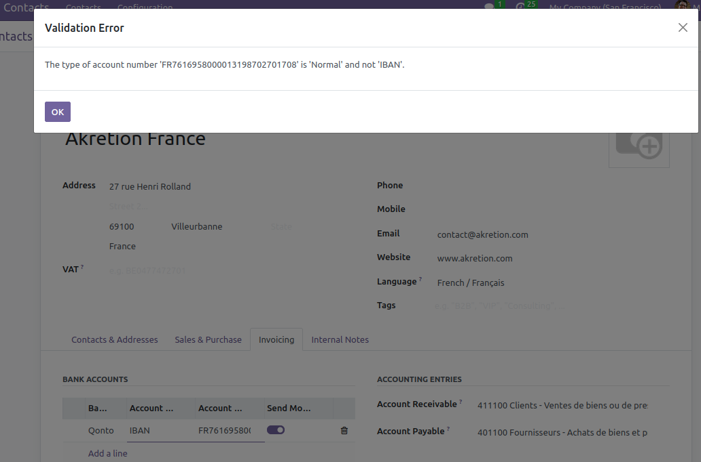

This module aims at restoring the behavior of bank account types of Odoo 8.0 and previous versions : the user manually selects the bank account type and, if the checkum doesn't match the selected bank account type, Odoo raises a blocking error message.

With Odoo 9.0 and upper versions, when a user enters an invalid IBAN in Odoo, he often don't realize that he has entered an invalid IBAN because he doesn't have any explicit error message.

With this module, when a user enters an invalid IBAN in Odoo, he will get an explicit error message that will prevent him from saving the account number.

