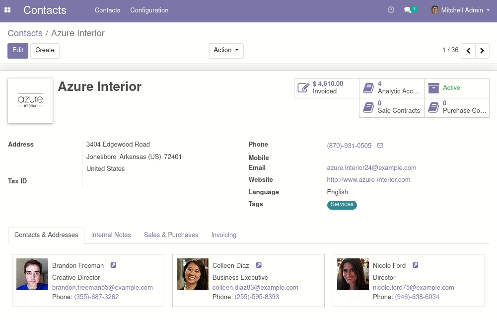

To use this module, you need to:

1.  Go to *Contacts* (if you don't see the menu, you might need to
    install the *Contacts* app, or go to any other module where you can
    browse partners).

2.  Select any contact that is a company and contains sub-contacts.

3.  You will see a new little button next to each contact's name that
    you can click to go to hers/his full form:

    
