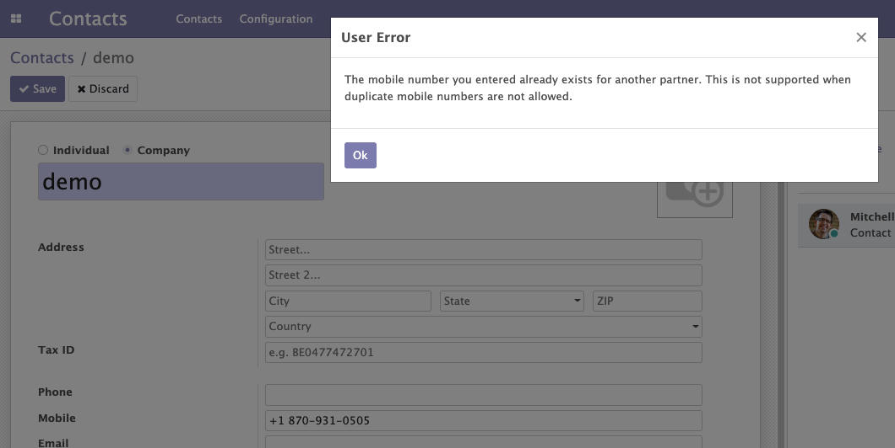

This module validates the field ``mobile`` in the model
``res.partner`` for duplication.

As part of the validation, this module throws error on the partner form view if another partner has the same mobile (Optionally).

This module has a twin brother named **partner_email_check** which restricts the partner creation when another partner has the same email.
