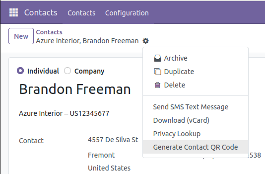
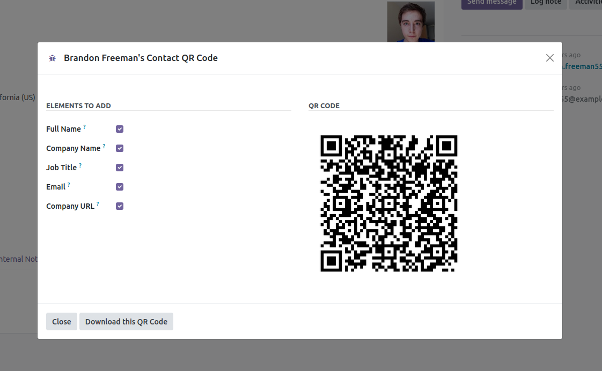
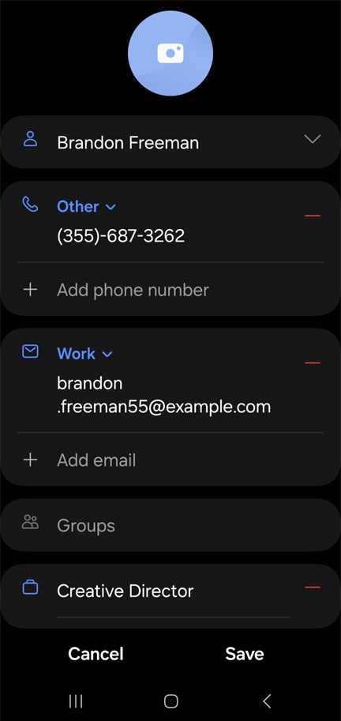

This module allows you to generate a QR Code with a contact information to then
transfer it to your phone.

It introduces a new button called *"Generate Contact QR Code"*
to the **Actions** section of the contacts module. This button opens a
wizard pop up that allows you to transfer the contact information
directly from your Odoo to your phone contacts.

The wizard also allows you to select which information you want from the contact
to transfer to your phone and download the QR Code afterwards if desired.

 Newly Added Button:

 QR Code Wizard:

 Information on the Phone:

